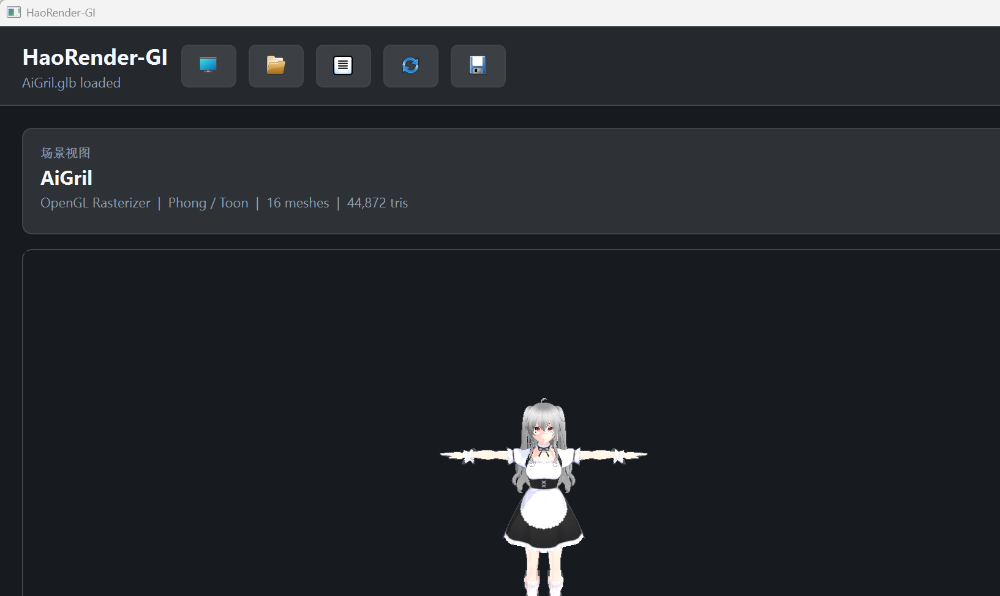
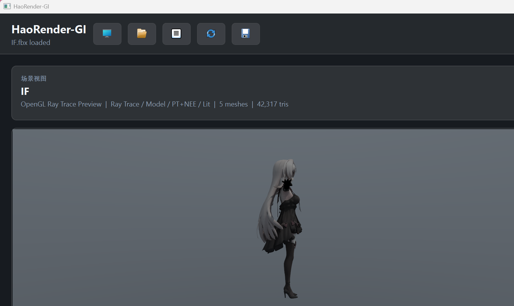
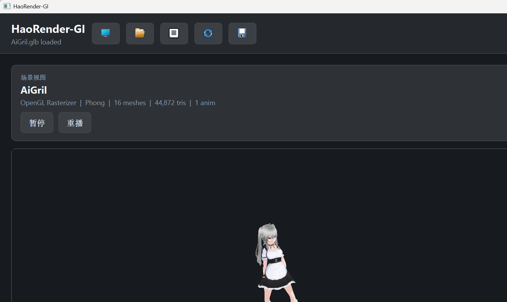

# HAORENDER-AI

HAORENDER-AI is a Windows Qt/C++ rendering workbench focused on GPU rendering, lightweight LookDev, toon/Phong/PBR parameter exploration, and AI-assisted humanoid animation retargeting.

The current product direction is a small artist-facing tool rather than a general DCC package:

- Raster, OpenGL ray trace, and DXR preview modes
- Phong, Toon, and PBR LookDev controls
- LookDev AI prompt workflow with Doubao/OpenAI-compatible local configuration
- Style preset save/load through `.haostyle.json`
- VRM/glTF/FBX loading through Assimp and local glTF helpers
- VRM MToon material adaptation, expression controls, eye gaze preview
- HaoRig AI skeleton mapping and animation retarget preview
- Batch retarget quality testing for downloaded FBX/VRMA motion sets

## Demo Screenshots







## Build

The project is configured with CMake and Qt 5.

```powershell
cmake -S . -B build -G "Visual Studio 17 2022" -A x64
cmake --build build --config Release --target HaoRender-GI -- /m
```

The local workstation build expects Qt, Eigen, Assimp, and DXC runtime paths to be available. See `CMakeLists.txt` for the current dependency hints and post-build runtime copy rules.

## AI Configuration

Do not commit real keys. Copy `llm.env.example` to `llm.env.local` and edit it locally:

```env
AI_PROVIDER=doubao
DOUBAO_API_KEY=<set locally, never commit a real key>
DOUBAO_BASE_URL=https://ark.cn-beijing.volces.com/api/v3
DOUBAO_MODEL=doubao-seed-2-0-pro-260215
AI_REQUEST_TIMEOUT_MS=90000
```

The app also checks environment variables and the user config path before falling back to local rule-based recommendations.

## Package

After a Release build:

```powershell
powershell -ExecutionPolicy Bypass -File scripts/package_release.ps1
```

The script creates a portable Windows zip under `dist/` containing the executable, Qt/Assimp/DXC runtime DLLs, Qt plugins, docs, style presets, and the safe AI env template.
The executable target is still named `HaoRender-GI.exe` in this preview build.

## Retarget QA

The batch test target validates mapping and retarget stability across local motion datasets:

```powershell
cmake --build build --config Release --target HaoRigBatchTest -- /m
build\Release\HaoRigBatchTest.exe --target "F:\AIGril\Resources\AiGril.glb" --source "path\to\motion.fbx"
```

Recent large local checks covered MAXIMO/SHE and harvested Mixamo-style motions. See `RELEASE_NOTES.md` for the current results and known limitations.

## License

HAORENDER-AI is open source under the MIT License. See `LICENSE` for details.
